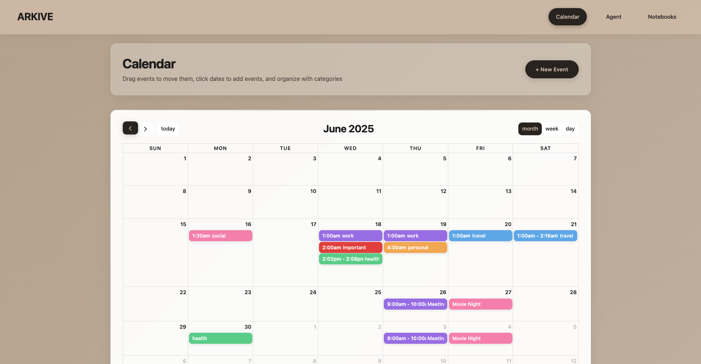

# ARKIVE

ARKIVE is a digital backpack for students, offering centralized access to digital textbooks, planners, notes, and productivity tools.




## 🚀 Features

- 📚 Digital textbook viewer  
- 🗓️ Calendar and planner integration  
- 📝 Smart notes with organization by subject or category  
- ✅ Task and assignment tracking  
- 🔍 Unified search across materials  

## 🛠️ Setup Instructions

1. **Clone the repository:**

   ```bash
   git clone https://github.com/Deepika-Partha/ARKIVE.git
   cd ARKIVE
   
2. **Install dependencies:**

   ```bash
   npm install #only this is needed to install all dependencies if package.json is downloaded

   --- CALENDAR ---
   npm install @fullcalendar/core @fullcalendar/daygrid @fullcalendar/interaction
   npm install --save-dev @types/fullcalendar

   --- NOTEBOOKS ---
   npm install mammoth
   npm install docx
   npm install pdfjs-dist

   --- DATABASE ---
   npm install express
   npm install dotenv
   npm install mongoose
   npm install bcrypt
   npm install jsonwebtoken
   
3. **Run the development server:**

   ```bash
   npm run dev (FROM "arkive" folder)
   ```in a separate terminal
   node server/index.js (FROM "arkive" folder)
   
4. **Testing:**

   ```bash
   npx jest
   npx jest --coverage
   
